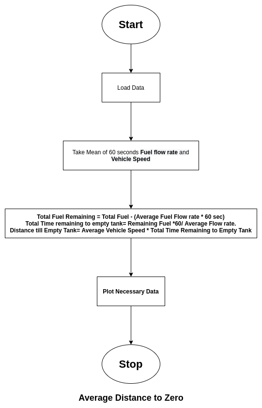
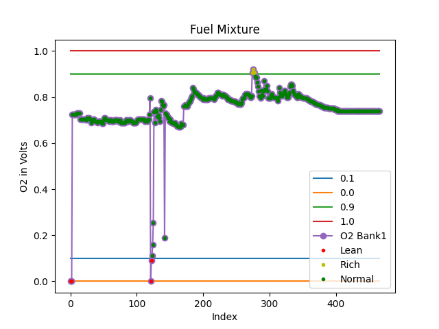
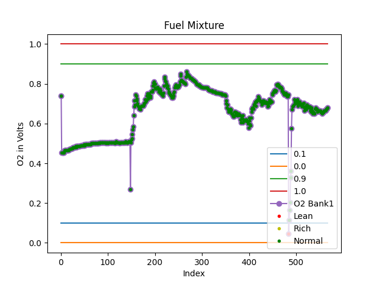
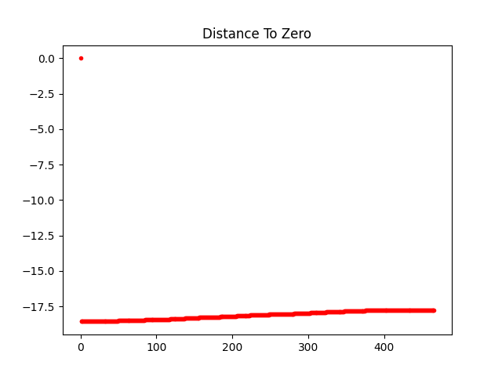
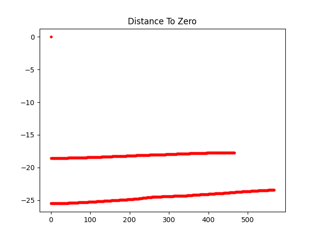

# Fuel Mixture
The stoichiometric ratio is the exact ratio between air and flammable gas or vapor at which complete combustion takes place.
The number of instances when the combustion is lean (More air and
less fuel) or rich (More fuel and less air) will directly affect the mileage and engine performance.

#Average Distance
Suppose someone drives a car from one city to another and does not have clear understanding of the how much km/miles the vehicle will travel before it stops due to low fuel. Scary is not it ? Dont worry we are at your service , our state-of-the art algorithm keeps track of your fuel level , current mileage and even fuel mixture for correct and accurate average distance to zero fuel calculation.

### So How are we addressing the problem ?
Our Algorithm is explained in below flowchart.

# Input
 
-   O2 Volts Bank 1 sensor 2(V)
- Distance Travelled
- Vehicle Mileage
- Fuel Level

# Output
 
##Fuel Mixture Analysis
-   Dataset 1 Fuel Mixture Data

-   Dataset 2 Fuel Mixture Data

-   Dataset 3 Fuel Mixture Data

## Average Distance Analysis
-   Dataset 1 Average Distance

-   Dataset 2 Average Distance

-   Dataset 3 Average Distance

## Coverage
[Link](https://raw.githack.com/prithvisekhar/VehicalDiagnosticAlgo/gh-pages/Function/DIAFuelMixture_FuelMixture/htmlcov/index.html)
